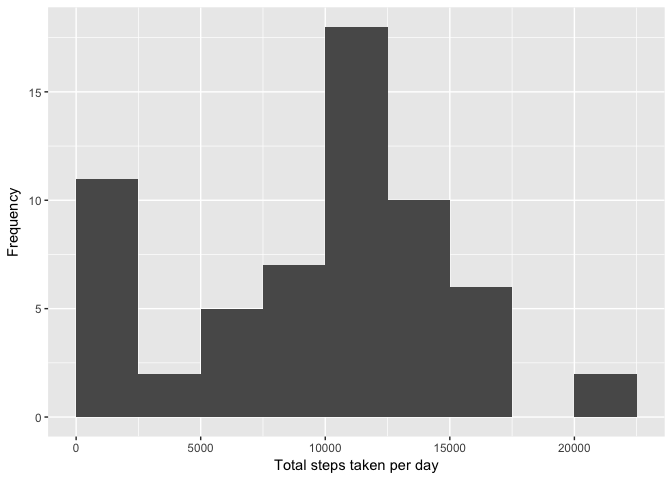
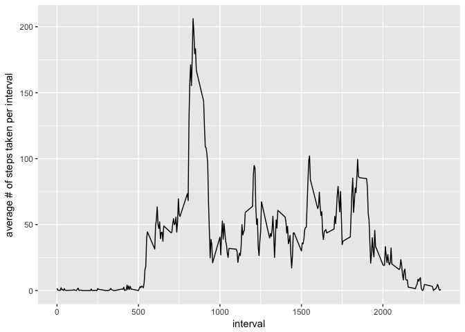
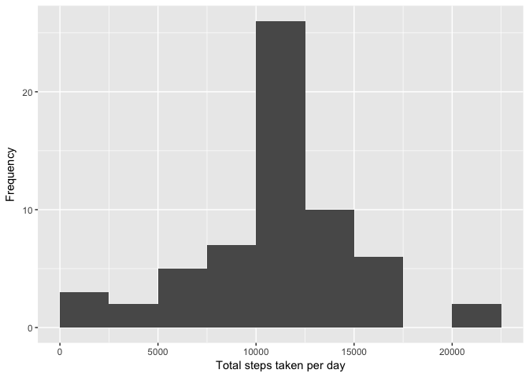
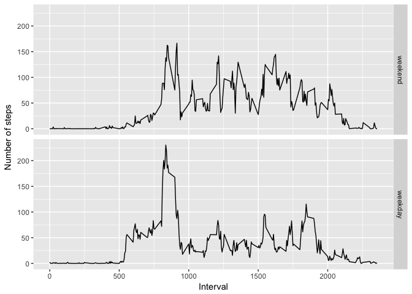

Loading & preprocessing data
============================

Download and unzip data file
----------------------------

    URL <- "https://d396qusza40orc.cloudfront.net/repdata%2Fdata%2Factivity.zip"
    zipfile <- "activity.zip"
    filename <- "activity.csv"

    if (!file.exists(filename)) {
        download.file(URL, zipfile, method = "curl")
        unzip(zipfile, overwrite = T)
    }

    ## Load the data
    activity <- read.csv("activity.csv")
    names(activity)

    ## [1] "steps"    "date"     "interval"

We can see that there are 3 columns in this data set.

Convert date column into date format
------------------------------------

    activity$date <- as.Date(activity$date, "%Y-%m-%d")

What is mean total number of steps taken per day?
=================================================

Computing the mean number of steps taken per day
------------------------------------------------

    library (dplyr)

    ## 
    ## Attaching package: 'dplyr'

    ## The following objects are masked from 'package:stats':
    ## 
    ##     filter, lag

    ## The following objects are masked from 'package:base':
    ## 
    ##     intersect, setdiff, setequal, union

    stepsbyday <- activity %>% group_by(date) %>%
                    summarize(total.steps = sum(steps, na.rm = T))

Here we have summarized the total number of steps taken per day. Now we
can plot this data using ggplot.

    library(ggplot2)
    g <- ggplot(stepsbyday, aes(x=total.steps))
    g + geom_histogram(origin = 0, binwidth = 2500) + labs(y="Frequency", x="Total steps taken per day")

    ## Warning: `origin` is deprecated. Please use `boundary` instead.

It can be inferred from the histogram that the median is most likely in
the 10000~12500 steps column. We can check via a summary of the results.

    summary(stepsbyday$total.steps)

    ##    Min. 1st Qu.  Median    Mean 3rd Qu.    Max. 
    ##       0    6778   10400    9354   12810   21190

The summary shows that the median is 10400 steps per day, indeed in the
10000-12500 bracket.

What is the average daily activity pattern?
===========================================

This time we will analyze steps activity across 5-minute intervals.
-------------------------------------------------------------------

    stepsbyinterval <- activity %>% group_by(interval) %>%
          summarize(mean.steps = mean(steps, na.rm = T))
    g2 <- ggplot(stepsbyinterval, aes(x = interval, y = mean.steps))
    g2 + geom_line() + labs(y="average # of steps taken per interval", x = "interval")

Again, we have summarized the mean steps taken per interval and plotted
it using ggplot. The plot illustrates that the maximum occurs at an
interval between 750 and 1000. In order to identify the exact interval,
we use the following code.

    stepsbyinterval[stepsbyinterval$mean.steps == max(stepsbyinterval$mean.steps), ]

    ## # A tibble: 1 × 2
    ##   interval mean.steps
    ##      <int>      <dbl>
    ## 1      835   206.1698

The interval containing the maximum number of steps on average is 835.

Imputing missing values
=======================

Calculate the total number of missing values in this dataset.
-------------------------------------------------------------

The following calculation shows the amount of NAs in the datatset.

    sum(is.na(activity$steps))

    ## [1] 2304

There are 2304 NAs.

Filling in the NAs
------------------

We can generally conceive of 2 methods to fill in the NAs.

-   Fill via the mean of each day
-   Fill via the mean of each interval

The first method, however, has a major drawback in that the number of
steps taken varies greatly depending on the interval. Therefore, we will
use the second method.

Before we proceed, we will check to see if there are any missing values
in the "stepsbyinterval" data we created earlier.

    sum(is.na(stepsbyinterval$mean.steps))

    ## [1] 0

There are no missing values, so we can proceed.

Creating a new dataset without any missing values
-------------------------------------------------

    activity2 <- activity
    for (i in 1:nrow(activity2)) {
          if (is.na(activity2$steps[i])) {
                interval.value <- activity2$interval[i]
                steps.value <- subset(stepsbyinterval, interval==interval.value)
                activity2$steps[i] <- steps.value$mean.steps
          }
    }

With the above we have created a new dataset(activity2) and have
replaced NA values with corresponding interval mean steps taken values.
We can now create a histogram with the new dataset.

Create histogram, analyze & compare results
-------------------------------------------

We can recreate the total number of steps taken per day histogram by
taking a similar approach as before.

    stepsbyday2 <- activity2 %>% group_by(date) %>%
        summarize(total.steps2 = sum(steps, na.rm=TRUE))

Now we can plot the histogram.

    g3 <- ggplot(stepsbyday2, aes(x = total.steps2))
    g3 + geom_histogram(origin = 0, binwidth = 2500) + xlab("Total steps taken per day") + ylab("Frequency")

    ## Warning: `origin` is deprecated. Please use `boundary` instead.

The plot shows that while the new dataset is similarly distributed,
there is a higher concenration towards the center of the
distribution(10000~12500 steps). We can view the summary below for more
information.

    summary(stepsbyday2$total.steps2)

    ##    Min. 1st Qu.  Median    Mean 3rd Qu.    Max. 
    ##      41    9819   10770   10770   12810   21190

    summary(stepsbyday$total.steps)

    ##    Min. 1st Qu.  Median    Mean 3rd Qu.    Max. 
    ##       0    6778   10400    9354   12810   21190

Comparison of the two summaries confirms our observation that there is a
higher skew towards the middle, evidenced by a higher 1st quartile
value.

Are there differences in activity patterns between weekdays and weekends?
=========================================================================

Separating between weekdays and weekends
----------------------------------------

First, we must filter between weekdays and weekends. In order to do
this, we create an extra column called "day". It is important to set the
language settings to English first if this is not the default.

    Sys.setlocale("LC_ALL", "en_US")

    ## [1] "en_US/en_US/en_US/C/en_US/ko_KR.UTF-8"

    activity2$day <- ifelse(weekdays(activity2$date) %in% c("Saturday", "Sunday"), "weekend", "weekday")

Now we can create filters based on that column.

    wkend <- filter(activity2, day == "weekend")
    wkday <- filter(activity2, day == "weekday")

Create panel plot grouped by the intervals
------------------------------------------

Similarly to before, we group by the intervals and calculate the mean
number of steps for each interval for each subset(wkend, wkday).

    wkendsteps <- wkend %>% group_by(interval) %>%
          summarize(mean.steps = mean(steps)) 
    wkendsteps$day <- "weekend"

    wkdaysteps <- wkday %>%
          group_by(interval) %>%
          summarize(mean.steps = mean(steps)) 
    wkdaysteps$day <- "weekday"

Then, we combine the two subsets and select the day column to be the
factor.

    stepsbyinterval2 <- rbind(wkendsteps, wkdaysteps)
    stepsbyinterval2$day <- as.factor(stepsbyinterval2$day)
    stepsbyinterval2$day <- relevel(stepsbyinterval2$day, "weekend")

Now we can create the plot.

    g4 <- ggplot(stepsbyinterval2, aes(interval, mean.steps))
    g4 + geom_line() + facet_grid(day~.) + xlab("Interval") + ylab("Number of steps")

In comparing the two graphs, we can observe that activity peaks in the
morning during weekdays while in weekends, activity is more consistent
throughout. This makes sense given that the interval coincides with
commuting hours during weekdays.
